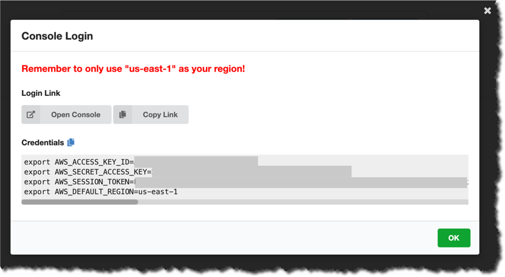
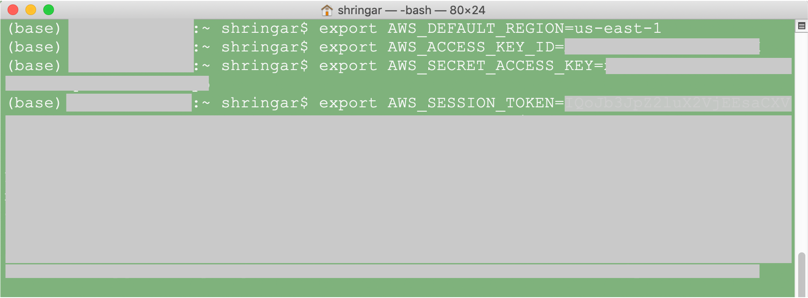

# Analytics Workshop
The intent of this workshop is to take the participants through a process of building a complete pipeline. 
Starting from ingesting the data. Processing it, and finally consuming the data.

## Brief
The workshop takes you through 3 labs and a preparatory section. The preparatory section creates fake data
that the workshop participant can use to populate an Amazon Aurora MySQL database. As records are added,
the particpants moves on to the next lab. To access the labs navigate to the `instructions` directory in 
this repository.

**Note: While copying commands from workshop instructions, make sure you remove all newlines from the commands**

## Pre-requisites
1. Before you begin, you should have the AWS CLI installed ([instructions for AWS CLI](https://docs.aws.amazon.com/cli/latest/userguide/cli-chap-install.html)).
2. You will be provided a hash, 16 or 12 characters in length.
3. On your browser, navigate to https://dashboard.eventengine.run/dashboard
4. When prompted, provide the hash. Accept terms and proceed.
5. This will take you to the **Team Dashboard**. 
6. Click on the **AWS Console** button. Proceed to the next step.
7. Instructions for setting up AWS credentials from the sandbox environment shared with you are as follows,
    a.  Simply copy the export commands from the Event Engine dashboard
        screen. In case you are using Linux/MacOS, and you should simply paste
        the commands you copied to your command prompt so the environment 
        variables take effect.

    b.  In case of Windows, copy the commands from the Windows tab in
        the Event Engine dashboard screen, and paste it to the command
        prompt.

    c.  Do the same for the Powershell prompt if you are using
        Powershell

        For this workshop, we will assume that we are using Linux/Mac
        based clients except when we are using the AWS Management
        Console. 
3. You should install `wget`, you can find the installation instructions for Mac [here](https://macappstore.org/wget/). 
   For Linux, you may [follow these instructions](https://linuxize.com/post/wget-command-examples/).
   Finally, you can install `wget` for Windows, [follow these instructions](http://gnuwin32.sourceforge.net/packages/wget.htm).

### Lab 0
The participants will create the initial setup that will generate the data for them for the rest of this
workshop. Instructions for **Lab 0** [available here](https://github.com/OmarKhayyam/data-lake-ws/blob/master/instructions/Lab%200%20-%20Prep%20for%20Data%20Lake%20Workshop%20for%20Fintechs%20V2.md).

### Lab 1
Here, the particpant sets up ingestion to move transactional data from the database to a Kinesis Data stream.
Instructions for **Lab 1** [available here](https://github.com/OmarKhayyam/data-lake-ws/blob/master/instructions/Lab%201%20-%20Data%20Lake%20Workshop%20for%20Fintechs%20V2.md).

### Lab 2
In this lab the participant moves to the next stage, where the data is cataloged. This process is run on a
continuous basis as the changes keep streaming in. Instructions for **Lab 2** [available here](https://github.com/OmarKhayyam/data-lake-ws/blob/master/instructions/Lab%202%20-%20Data%20Lake%20Workshop%20for%20Fintechs%20V2.md).

### Lab 3
Finally, this lab demonstrates how easy it is to setup Amazon Athena and Amazon Redshift to query the data. 
Instructions for **Lab 3** [available here](https://github.com/OmarKhayyam/data-lake-ws/blob/master/instructions/Lab%203%20-%20Data%20Lake%20Workshop%20for%20Fintechs%20V2.md).

