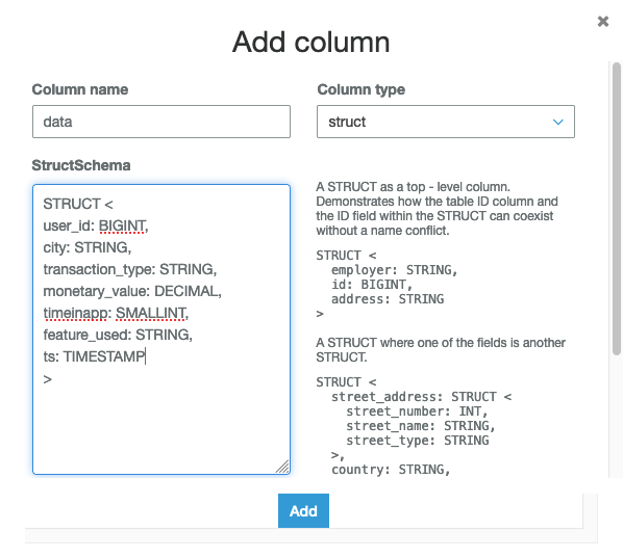
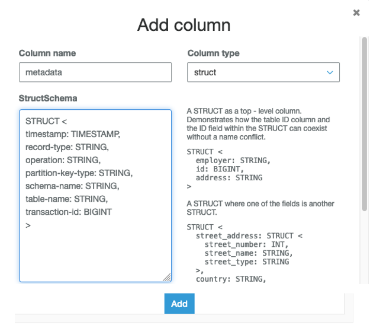
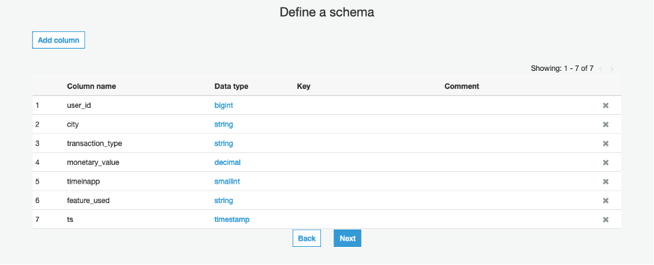
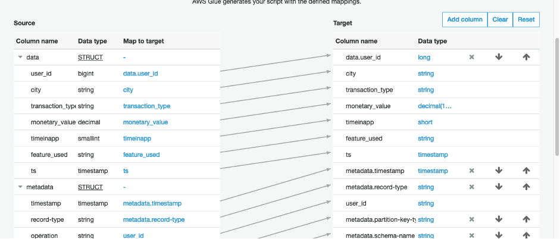
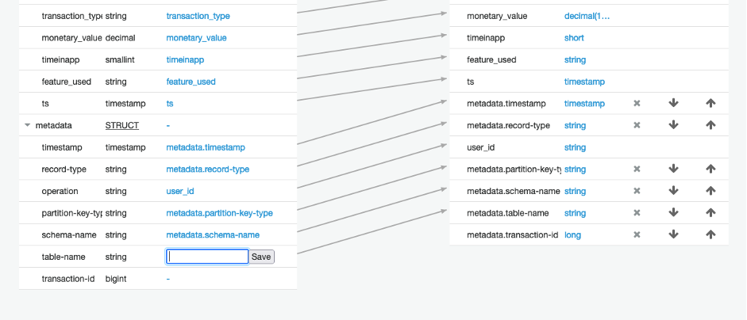
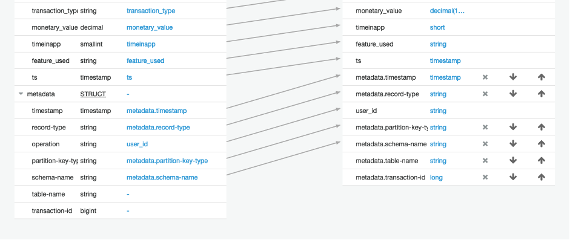
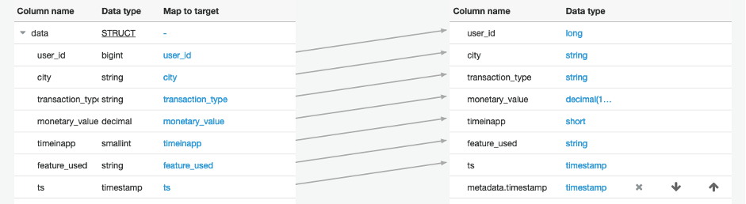

Data Lake workshop for Fintechs -- Instructions
===============================================

Lab 2 - Cataloguing
-------------------

19. Next, go back to your laptop/desktop and navigate to the
    Cloudformation console. Choose the stack, and click the Update
    button. Use the **cataloguing/CatalogingLayer.yml** file for the
    update. Follow the same process as for the last update.

20. Once the update from the last step is complete. Manually add a table
    to the Glue Data Catalog. Proceed to the Glue console, click on
    **Databases** in the left panel, you will find the database named
    **datalakeworkshopdb**, click on it. In the next page, click on
    **Tables in \<your database name\>**. On the next page, click on the
    **Add tables button**.

21. Choose to **Add a table manually.** Provide a table name, say,
    **customerrequests.** Click the **Next button.** On the next page,
    in **Type of datastore**, choose **Kinesis**. The region will have
    been chosen, choose your stream from the drop-down for **Stream
    name**. Ignore **Sample size**. Click **Next**.

22. On the next page, choose a **Classification**, in your case it is
    **JSON**, click **Next**.

23. On the next page, we provide the schema. Click on the **Add column**
    button. Give the column a **Name**, choose a column type from the
    **Column type** drop down.

24. The first column will be named **data**, and will be defined like
    so,

    

25. The second column should be defined like so,

    

26. Click **Next**. And **Next** again. Review on the next page and
    click **Finish**.

27. We created the source table, we will now create the destination
    table. Proceed with the same steps as before until we reach the step
    where we add columns. Remember to set S3 as your data source this time.
    Provide an **Include path**, this path is the path to the
    destination S3 bucket with prefix where you intend to deliver the payload
    from your Glue ETL job, choose the S3 bucket from the Cloudformation stack
    output, look for **GlueOutputBucket** in the Outputs. 
    Choose JSON as the classification. Finally, the columns should look like so,

    

28. Click **Next**. And then **Next** again. End with **Finish** as we
    did previously.

29. Click **Jobs** in the left panel under ETL. Then the **Add job
    button**. On the **Configure the job properties** page give the job
    a **Name.** For the **IAM role,** from the drop down, choose the
    role that have the string **WSGlueRole** in it**.** In **Type,**
    choose **Spark Streaming** from the drop-down**.** Uncollapse the
    **Security configuration, script libraries, and job parameters**. In
    the Security configuration drop-down choose the one we created, it
    would be the one that has the string **Workshop** in its name. Click
    **Next**. For data source, choose table with the location set to the
    Kinesis stream we created, click **Next**. In **Choose a data
    target** page, make sure you have chosen **Use tables in the data
    catalog and update your data target**, then choose the destination
    table we created in step 27 and click **Next**.

30. On the **Output Schema Definition** page, make sure that **Specify
    output schema for all records** is already chosen. The table
    mappings will look something like this,

    

31. We want to get rid of the metadata mappings, this is how you can do
    that, click in the white rectangle of the struct member whose
    mapping you want to remove, this results in a **textbox** with a
    **Save** button in the **Map to target.**

    

32. Now click the **Save button,** this will remove the mapping, like
    so,

    

33. Continue this until you remove all the mappings for the **metadata**
    STRUCT.

    

34. Click on **Save job and edit script**. On the next page, click **Run
    job**. You should see the files getting populated in the destination
    bucket/prefix location you had specified when you created the
    destination table in step 27.
